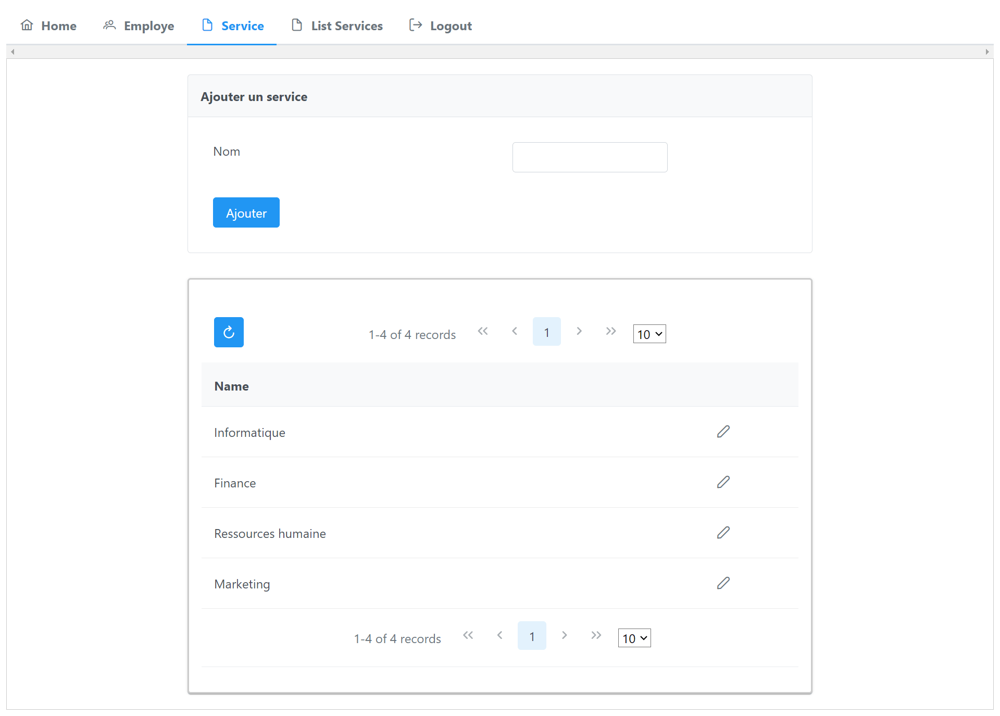
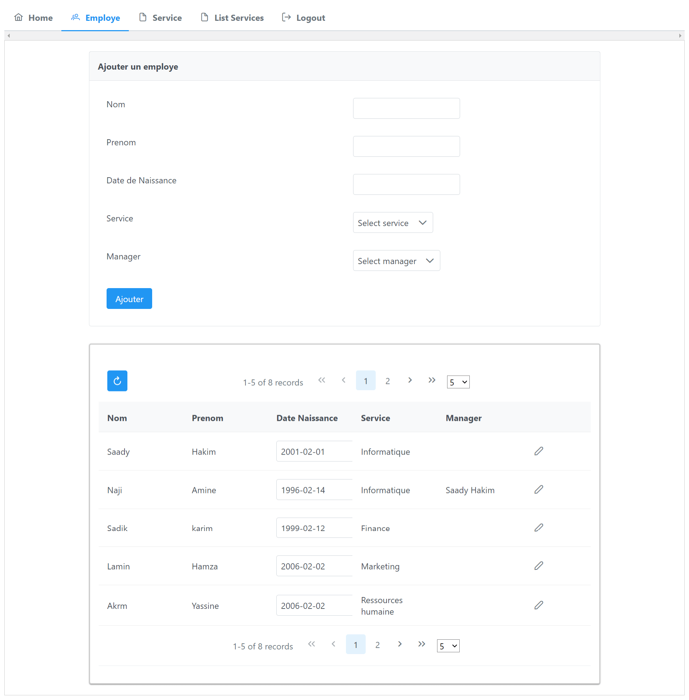
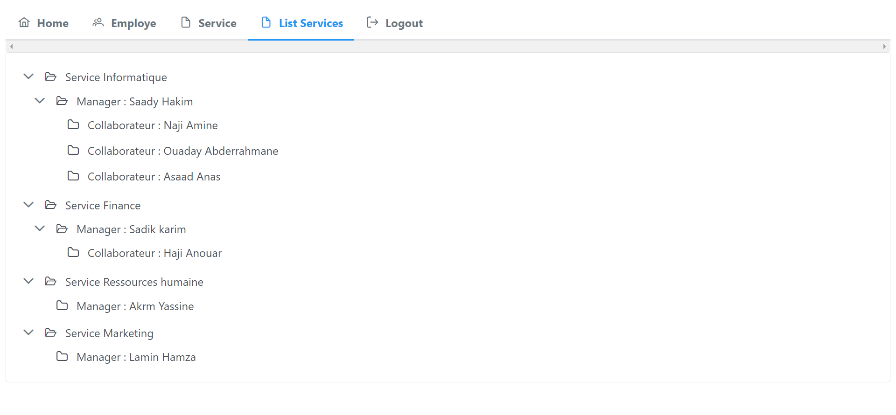

# Employee Management Project with PrimeFaces

## Objective
The goal of this project is to develop a web application using Java Server Faces (JSF) to manage employees in a company based on their respective services. The application will enable CRUD (Create, Read, Update, Delete) operations on employee data organized by services.

## Technologies Used
- **Java Server Faces (JSF)**: Java framework for developing component-based web applications.
- **Java EE (Enterprise Edition)**: Execution platform for Java enterprise applications.
- **Java Persistence API (JPA)**: Java specification for managing data persistence.
- **PrimeFaces**: Library of rich and responsive JSF components.
- **MySQL**: Database for storing application data.

## Features
The application provides the following features:

- **Display Employees**: List of employees organized by services.
- **Add Employee**: Form to add a new employee with assignment to the corresponding service.
- **Update Employee**: Ability to update employee information.
- **Delete Employee**: Remove an employee from the database.
- **Service Management**: Add, update, and delete available services.

## Project Structure
The project is structured as follows:

- `src/main/java`: Contains the Java classes of the project.
- `src/main/resources`: Resources required for the project, such as configuration files.
- `src/main/WEB-INF`: Contains JSF pages, CSS files, JavaScript, and web resources.
- `src/test`: Directory for unit tests.

## Configuration
1. **Database**: Configure the database connection parameters in the `hibernate.cfg.xml` file.
2. **Application Server**: Deploy the application on a Java-compatible server (e.g., Glassfish).

## Login page

# Service

## Employees

## Emoloyee By Service

